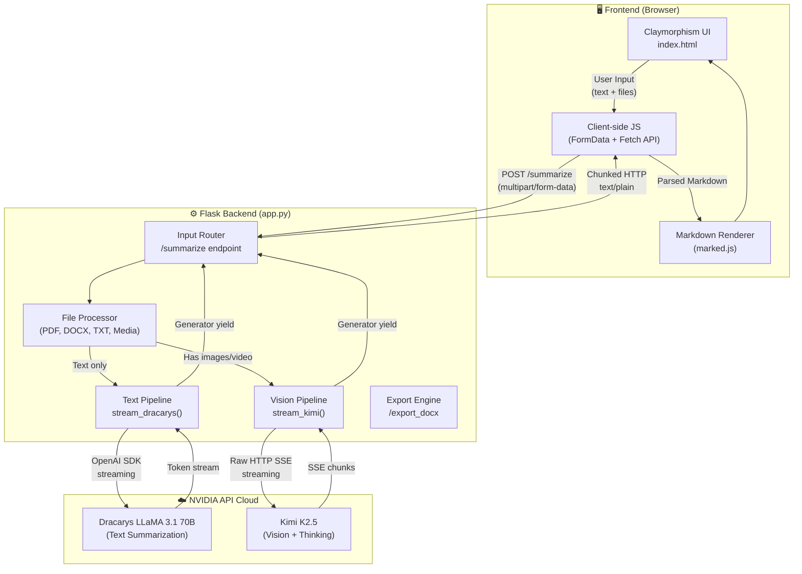
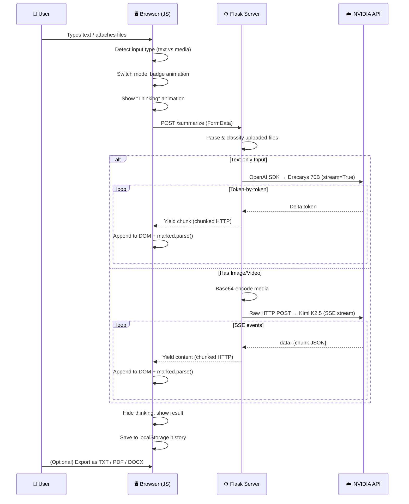
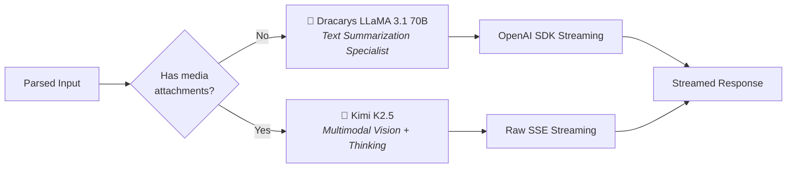
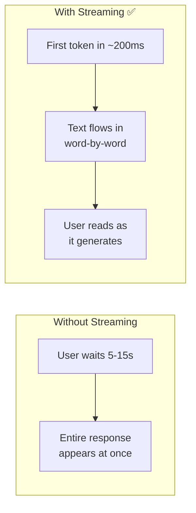
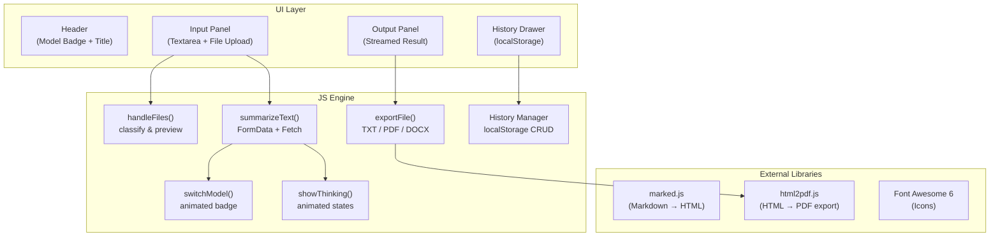
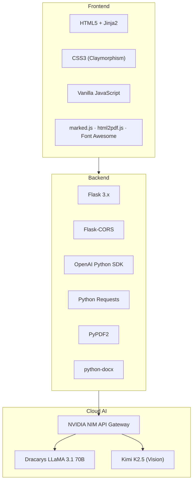

# 🏗️ Lumina AI Text Synthesizer — Architecture Flow & Technical Deep-Dive

## Project Overview

**Lumina** is a multimodal AI content synthesizer built on a **Flask + Jinja2** backend and a **single-page HTML/CSS/JS** frontend. It intelligently routes user input to one of two NVIDIA-hosted large language models depending on content type, and streams the AI response back to the browser in real time.

---

## High-Level Architecture



---

## End-to-End Data Flow

### Step-by-Step Request Lifecycle



---

## Core Components

### 1. 📥 Input Layer — File Processing

The system accepts **5 categories** of input, each processed differently:

| Input Type | Extensions | Processing Method | Destination Model |
|---|---|---|---|
| **Raw Text** | *(textarea)* | Direct pass-through | Dracarys |
| **Plain Text Files** | `.txt` | `file.read().decode('utf-8')` | Dracarys |
| **PDF Documents** | `.pdf` | `PyPDF2.PdfReader` → page-by-page text extraction | Dracarys |
| **Word Documents** | `.docx` | `python-docx` → paragraph iteration | Dracarys |
| **Images** | `.png .jpg .jpeg .gif .webp` | Base64 encode → data URI | Kimi K2.5 |
| **Video** | `.mp4 .webm` | Base64 encode → data URI | Kimi K2.5 |

> [!IMPORTANT]
> The routing decision is binary: if **any** media file (image/video) is present in the upload, the entire request is routed to **Kimi K2.5**. Otherwise, all extracted text goes to **Dracarys**.

---

### 2. 🧠 Dual-Model Routing — The Core Intelligence

This is the project's central architectural decision. Instead of using a single do-everything model, Lumina employs **task-specific model routing**:



#### Model A: Dracarys LLaMA 3.1 70B Instruct

| Property | Detail |
|---|---|
| **Provider** | AbacusAI via NVIDIA NIM |
| **Architecture** | LLaMA 3.1 70B (fine-tuned by AbacusAI) |
| **Specialization** | Text comprehension & summarization |
| **API Protocol** | OpenAI-compatible SDK (`openai` Python package) |
| **Temperature** | `0.5` (balanced creativity & accuracy) |
| **Max Tokens** | `1024` |
| **Why this model?** | Fine-tuned specifically for instruction-following and text summarization tasks, making it more accurate than a generic LLM for condensing large text inputs. |

#### Model B: Kimi K2.5 (Moonshot AI)

| Property | Detail |
|---|---|
| **Provider** | Moonshot AI via NVIDIA NIM |
| **Architecture** | Multimodal transformer with vision encoder |
| **Specialization** | Image understanding, video analysis, visual reasoning |
| **API Protocol** | Raw HTTP with SSE (Server-Sent Events) |
| **Temperature** | `1.0` (more creative descriptions) |
| **Max Tokens** | `16384` (much higher — vision tasks produce longer outputs) |
| **Thinking Mode** | `chat_template_kwargs: {thinking: True}` — enables chain-of-thought reasoning |
| **Why this model?** | Natively processes images/video as base64 data URIs, supports extended thinking for deeper visual analysis. |

---

### 3. 🌊 Streaming Response Architecture

Both models use **streaming** to deliver responses token-by-token rather than waiting for the full response. This is a critical UX technique:



#### How Streaming Works in This Project

**Dracarys (OpenAI SDK path):**
```
Client ←── Flask Generator (yield) ←── OpenAI SDK (stream=True) ←── NVIDIA API
```
- Uses the `openai` Python SDK with `stream=True`
- Each `chunk.choices[0].delta.content` is yielded from a Python generator
- Flask wraps the generator in a `Response(..., mimetype='text/plain')` — this triggers **HTTP chunked transfer encoding**

**Kimi K2.5 (Raw SSE path):**
```
Client ←── Flask Generator (yield) ←── requests (stream=True) ←── SSE from NVIDIA
```
- Uses Python `requests` library with `stream=True`
- Manually parses SSE format: lines beginning with `data: ` contain JSON chunks
- Each JSON chunk's `choices[0].delta.content` is yielded
- The stream ends when `data: [DONE]` is received

**Frontend consumption:**
- The browser's `Fetch API` with `response.body.getReader()` reads chunks via the **ReadableStream** interface
- Each chunk is decoded with `TextDecoder`, appended to a running text buffer, and re-rendered as Markdown via `marked.parse()`

---

### 4. 🎨 Frontend Architecture

The frontend is a **single-file SPA** (`templates/index.html`) using the Jinja2 template engine, with all CSS and JS inlined.



#### Design System: Warm Dark Claymorphism

The UI uses a **claymorphism** design language — a soft, tactile aesthetic that combines:

- **Outer shadows** (`8px 8px 16px dark, -8px -8px 16px light`) → Creates the "raised clay" 3D effect
- **Inner shadows** (`inset 4px 4px 8px dark, inset -4px -4px 8px light`) → Creates "pressed in" wells for inputs
- **Warm color palette** (`#1a1410` base, `#d4a24a` amber accent) → Gives the organic, earthy feel
- **Animated background blobs** → Large radial gradients with blur and float animation

---

## Key Concepts & Techniques

### 🔑 1. Multimodal AI

The system processes **multiple modalities** (text, images, video) through a unified interface. The key insight is that different modalities require different model architectures:
- **Text** → Processed by a text-only transformer (more efficient, higher accuracy for summarization)
- **Vision** → Requires a model with a **vision encoder** (ViT or similar) that converts pixel data into token embeddings the transformer can reason about

### 🔑 2. API Gateway Pattern (NVIDIA NIM)

Both models are accessed through **NVIDIA NIM** (NVIDIA Inference Microservices), which acts as a unified API gateway. This means:
- Models run on NVIDIA's cloud GPUs (no local GPU required)
- The API is OpenAI-compatible, allowing use of the standard `openai` Python SDK
- Different providers (AbacusAI, Moonshot AI) are accessed through the same endpoint

### 🔑 3. Server-Sent Events (SSE) Streaming

The Kimi K2.5 model uses the **SSE protocol** — a standard for unidirectional server-to-client streaming:
```
data: {"choices": [{"delta": {"content": "Hello "}}]}
data: {"choices": [{"delta": {"content": "world"}}]}
data: [DONE]
```
Each line prefixed with `data: ` contains a JSON payload. The stream terminates with `data: [DONE]`.

### 🔑 4. Chain-of-Thought (Thinking Mode)

Kimi K2.5 is invoked with `"thinking": True`, which enables **chain-of-thought reasoning**. This means the model internally generates a reasoning trace before producing the final answer — particularly useful for complex visual analysis tasks like understanding charts, diagrams, or multi-object scenes.

### 🔑 5. Chunked Transfer Encoding

Flask's `Response(generator_function(), mimetype='text/plain')` automatically uses HTTP **chunked transfer encoding**. Instead of buffering the entire response, the server sends each `yield`ed piece immediately. The browser receives and displays each chunk as it arrives.

### 🔑 6. Base64 Data URI Encoding

Media files (images/video) are converted to **Base64 data URIs** for transmission to the vision model:
```
data:image/png;base64,iVBORw0KGgoAAAA...
```
This embeds the binary file data directly in the JSON payload, avoiding the need for separate file upload endpoints or object storage.

### 🔑 7. Client-Side History (localStorage)

Summarization history is persisted in the browser's `localStorage` — no database required. This is a **zero-infrastructure** persistence strategy:
- Entries are capped at 50 (to prevent storage overflow)
- Each entry stores: input text, output text, type (text/media), timestamp
- History survives page refreshes but is browser-specific

### 🔑 8. Multi-Format Export Pipeline

Results can be exported in three formats, each using a different technique:

| Format | Technique | Where it happens |
|---|---|---|
| **TXT** | `Blob` constructor + download link | Client-side only |
| **PDF** | `html2pdf.js` (HTML → Canvas → PDF) | Client-side only |
| **DOCX** | `python-docx` on server → binary download | Server-side (`/export_docx`) |

---

## Technology Stack Summary



---

## Summary

| Aspect | Implementation |
|---|---|
| **Architecture** | Monolithic Flask app with Jinja2 templating |
| **AI Strategy** | Dual-model routing (text specialist + vision specialist) |
| **Streaming** | Python generators → chunked HTTP → ReadableStream in browser |
| **File Processing** | PyPDF2 (PDF), python-docx (DOCX), base64 (media) |
| **UI Design** | Warm dark claymorphism with micro-animations |
| **State Management** | localStorage for history, no database |
| **Deployment** | Single `app.py` entry point, `flask run` on port 5000 |
