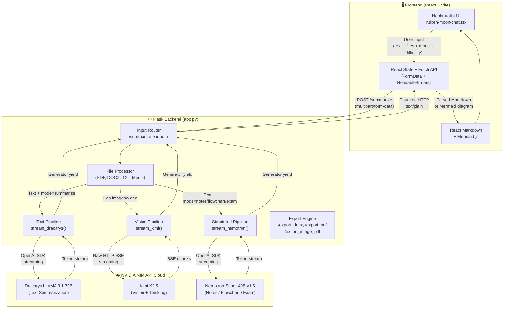
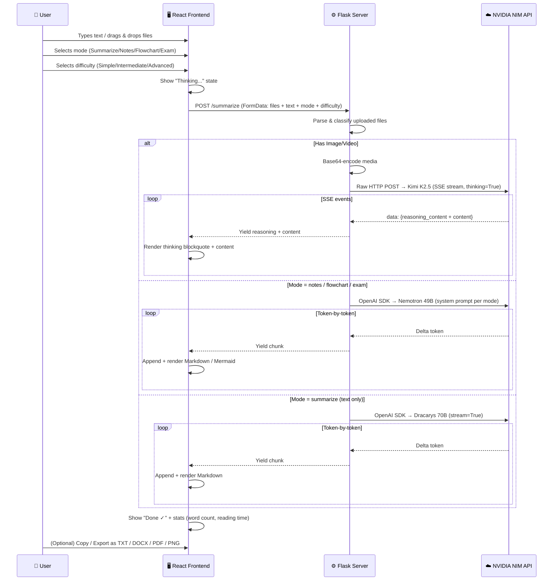
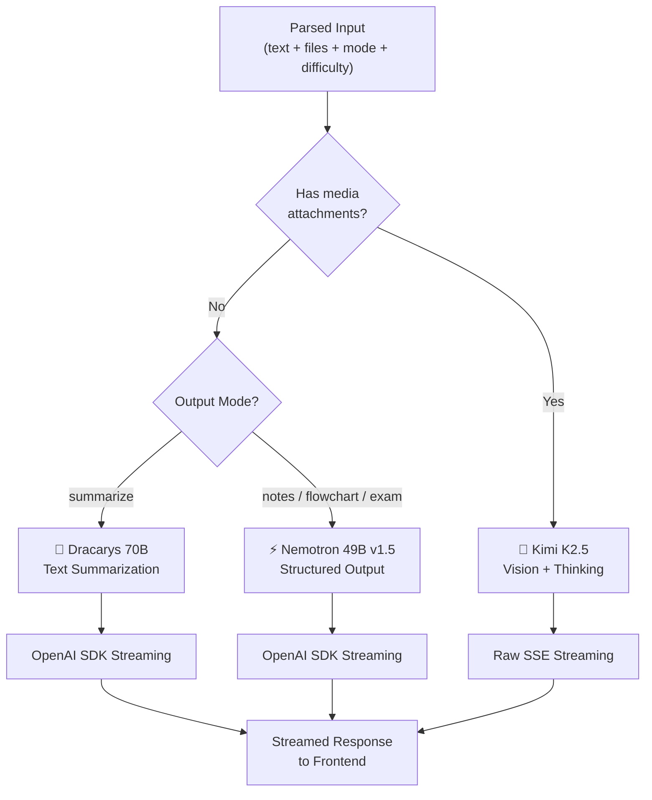
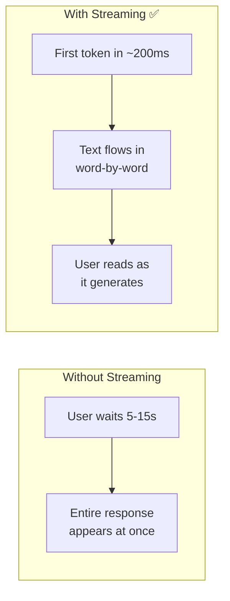
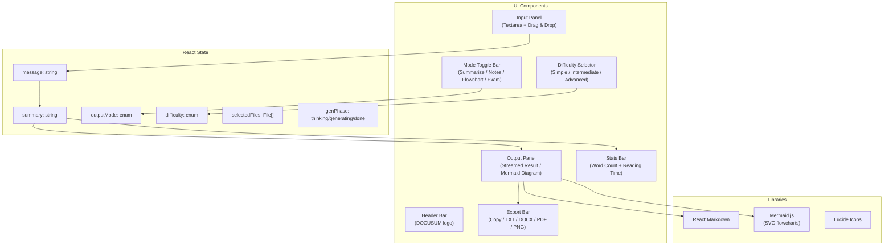
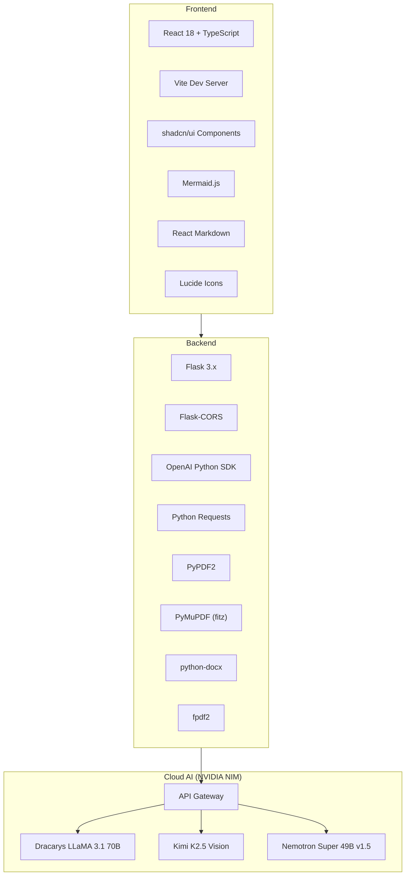

# 🏗️ DOCUSUM — Architecture Flow & Technical Deep-Dive

## Project Overview

**DOCUSUM** is a multimodal AI document synthesizer built on a **Flask** backend and a **React + Vite + TypeScript** frontend. It intelligently routes user input across **three NVIDIA-hosted AI models** depending on content type and output mode, streaming the response back to the browser in real time.

The system supports four output modes (Summarize, Notes, Flowchart, Exam Prep), three difficulty levels, and multi-format export — all wrapped in a bold **Neobrutalist** UI.

---

## High-Level Architecture



---

## End-to-End Data Flow

### Step-by-Step Request Lifecycle



---

## Core Components

### 1. 📥 Input Layer — File Processing

The system accepts **6 categories** of input, each processed differently:

| Input Type | Extensions | Processing Method | Destination Model |
|---|---|---|---|
| **Raw Text** | *(textarea)* | Direct pass-through | Dracarys or Nemotron |
| **Plain Text Files** | `.txt` | `file.read().decode('utf-8')` | Dracarys or Nemotron |
| **PDF Documents** | `.pdf` | `PyPDF2.PdfReader` → text extraction | Dracarys or Nemotron |
| **Scanned PDFs** | `.pdf` (no text) | `PyMuPDF` → page images → base64 | Kimi K2.5 |
| **Word Documents** | `.docx` | `python-docx` → paragraph text | Dracarys or Nemotron |
| **Images** | `.png .jpg .jpeg .gif .webp` | Base64 encode → data URI | Kimi K2.5 |
| **Video** | `.mp4 .webm` | Base64 encode → data URI | Kimi K2.5 |

> [!IMPORTANT]
> **Routing priority:** If **any** media (image/video) is present → Kimi K2.5. Otherwise, the `mode` parameter determines: `summarize` → Dracarys, `notes/flowchart/exam` → Nemotron.

---

### 2. 🧠 Tri-Model Routing



#### Model A: Dracarys LLaMA 3.1 70B Instruct

| Property | Detail |
|---|---|
| **Provider** | AbacusAI via NVIDIA NIM |
| **Model ID** | `abacusai/dracarys-llama-3.1-70b-instruct` |
| **Specialization** | Text comprehension & summarization |
| **API Protocol** | OpenAI-compatible SDK |
| **Temperature** | `0.5` |
| **Max Tokens** | `1024` |

#### Model B: Kimi K2.5 (Moonshot AI)

| Property | Detail |
|---|---|
| **Provider** | Moonshot AI via NVIDIA NIM |
| **Model ID** | `moonshotai/kimi-k2.5` |
| **Specialization** | Image/video understanding, visual reasoning |
| **API Protocol** | Raw HTTP with SSE |
| **Temperature** | `1.0` |
| **Max Tokens** | `16384` |
| **Thinking Mode** | `chat_template_kwargs: {thinking: True}` |

#### Model C: Nemotron Super 49B v1.5 (NVIDIA)

| Property | Detail |
|---|---|
| **Provider** | NVIDIA |
| **Model ID** | `nvidia/llama-3.3-nemotron-super-49b-v1.5` |
| **Specialization** | Structured output — notes, Mermaid flowcharts, exam materials |
| **API Protocol** | OpenAI-compatible SDK |
| **Temperature** | `0.6` |
| **Max Tokens** | `16384` |
| **System Prompts** | Mode-specific prompts with difficulty level prefixes |

---

### 3. 🎚️ Difficulty-Aware Prompting

Each request includes a difficulty level that modifies the AI's system prompt:

| Level | Behavior |
|-------|----------|
| **Simple** | "Use simple, easy-to-understand language suitable for beginners. Explain like teaching a 10th grader." |
| **Intermediate** | "Use clear, standard academic language. Balance detail with readability." |
| **Advanced** | "Use precise, technical language. Include in-depth analysis, edge cases, and expert-level detail." |

The difficulty prefix is prepended to both the Dracarys summarization prompt and the Nemotron mode-specific system prompts.

---

### 4. 🌊 Streaming Response Architecture

All three models use **streaming** to deliver responses token-by-token:



#### Streaming Paths

**Dracarys & Nemotron (OpenAI SDK):**
```
Browser ←── Flask Generator (yield) ←── OpenAI SDK (stream=True) ←── NVIDIA API
```

**Kimi K2.5 (Raw SSE):**
```
Browser ←── Flask Generator (yield) ←── requests (stream=True) ←── SSE from NVIDIA
```
- Parses `reasoning_content` (thinking) and `content` (final answer) separately
- Reasoning is formatted as markdown blockquotes (`> **Thinking Process...**`)

**Frontend consumption:**
- `Fetch API` + `ReadableStream` via `response.body.getReader()`
- Each chunk decoded with `TextDecoder`, appended to state, re-rendered as Markdown
- Auto-scroll keeps latest content visible during streaming

---

### 5. 🎨 Frontend Architecture

The frontend is a **React + TypeScript SPA** built with Vite, using shadcn/ui component primitives.



#### Design System: Neobrutalism

| Element | Implementation |
|---------|---------------|
| **Borders** | `border-4 border-black` — thick, solid, unapologetic |
| **Shadows** | `shadow-[6px_6px_0px_0px_#000]` — hard-offset, no blur |
| **Colors** | Cyan `#00ffff`, Magenta `#ff00ff`, Yellow `#ffdf00`, Green `#39ff14` |
| **Buttons** | Press-down effect: shadow collapses + translate on active |
| **Background** | Dotted yellow grid pattern |
| **Typography** | `font-black uppercase tracking-widest` |

---

### 6. 📤 Multi-Format Export Pipeline

| Format | How It Works | Endpoint |
|--------|-------------|----------|
| **TXT** | `Blob` constructor + download link | Client-side |
| **DOCX** | `python-docx` → binary stream | `/export_docx` |
| **PDF** (text) | `fpdf2` → binary stream | `/export_pdf` |
| **PNG** (flowchart) | SVG → Canvas (2x scale) → PNG blob | Client-side |
| **PDF** (flowchart) | SVG → Canvas → PNG → `fpdf2` landscape | `/export_image_pdf` |
| **Copy** | `navigator.clipboard.writeText()` | Client-side |

---

## Key Concepts & Techniques

### 🔑 1. Multimodal AI
Different input modalities require different model architectures:
- **Text** → Text-only transformer (efficient, focused)
- **Vision** → Model with vision encoder (ViT) that converts pixels to embeddings

### 🔑 2. Task-Specific Model Routing
Instead of one model for everything, DOCUSUM uses **three specialized models**, each optimized for its task. The router selects based on input type + output mode.

### 🔑 3. Mode-Specific System Prompts
Each output mode (Notes, Flowchart, Exam) has a carefully crafted system prompt that constrains the model's output format — e.g., forcing Mermaid syntax for flowcharts or structured Q&A for exam prep.

### 🔑 4. API Gateway Pattern (NVIDIA NIM)
All three models run on NVIDIA's cloud GPUs via NIM — no local GPU required. The API is OpenAI-compatible, allowing use of the standard Python SDK.

### 🔑 5. Chunked Transfer Encoding
Flask's `Response(generator, mimetype='text/plain')` triggers HTTP chunked encoding. Each `yield` sends data immediately — the browser sees tokens in real time.

### 🔑 6. Chain-of-Thought (Kimi Thinking Mode)
Kimi K2.5 with `thinking: True` generates internal reasoning traces before the final answer. These are streamed as blockquotes in the UI.

### 🔑 7. Client-Side Diagram Rendering
Flowchart mode generates Mermaid.js code server-side, which is then rendered as an interactive SVG diagram client-side — exportable as high-res PNG or PDF.

### 🔑 8. Difficulty-Adaptive Prompting
A difficulty prefix is injected into every system prompt, adjusting output complexity from beginner-friendly to expert-level without changing the underlying model.

---

## Technology Stack



---

## Summary

| Aspect | Implementation |
|---|---|
| **Architecture** | Flask backend + React/Vite frontend (decoupled) |
| **AI Strategy** | Tri-model routing (text + vision + structured output) |
| **Output Modes** | Summarize, Notes, Flowchart, Exam Prep |
| **Difficulty** | Simple / Intermediate / Advanced (prompt-level) |
| **Streaming** | Python generators → chunked HTTP → ReadableStream |
| **File Processing** | PyPDF2, PyMuPDF, python-docx, base64 encoding |
| **UI Design** | Neobrutalism — bold borders, hard shadows, high contrast |
| **Diagram Engine** | Mermaid.js (server generates code, client renders SVG) |
| **Export** | TXT, DOCX, PDF (text), PNG/PDF (flowcharts) |
| **Deployment** | `python app.py` (port 5000) + `npm run dev` (port 5173) |
